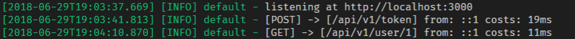

## node web server template

> 一个 `koa` + `typescript` 实现的 restful api 的模板

### 初心

      😃 😄 😅 😆 😉

### 效果图

### TODO LIST

- [x] 全局异常处理
- [x] 参数检验
- [x] 多级路由，路由分层，路由前缀
- [x] JWT 支持
- [x] BasicAuth 校验
- [x] json 数据返回中间件
- [x] 日志记录
- [x] ORM 框架集成
- [x] 配置文件驱动
- [ ] GraphQL 集成
- [ ] 优化，美观
